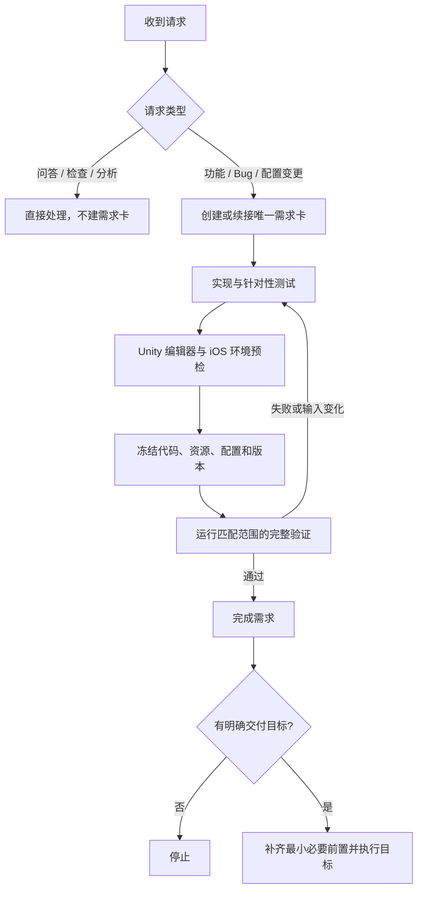

# Unity iOS TeamFlow

面向 Codex 驱动开发的中文 Unity 游戏工作流，优先覆盖 iOS 市场，同时保留 Unity 项目跨平台的基本边界。当前版本为 **1.0.1**。

它不是 Unity 工程模板，而是一套可安装到现有游戏仓库的协作规则和验证工具：用一张需求卡管理范围与验收条件，用项目真实命令生成可追溯验证证据，并把 Git、Xcode、TestFlight 和 App Store 动作限制在用户明确授权的目标内。

## 核心流程



固定收尾顺序：

```text
完成全部改动 → 环境预检 → 针对性测试 → 文件冻结 → 一次完整验证 → 目标交付
```

最终验证会记录所选 profile、每条命令的退出状态、日志和受跟踪输入指纹。验证后只要脚本、场景、Prefab、资源、Package、ProjectSettings、原生插件、测试或相关文档发生变化，旧证据就失效。

## 仓库结构

| 位置 | 作用 |
| --- | --- |
| `AGENTS.md` | 项目级入口与行为边界 |
| `.agents/skills/unity-ios-team-flow/SKILL.md` | 按任务路由专题资料 |
| `.agents/skills/unity-ios-team-flow/references/` | Unity、iOS、测试、性能和发布规则 |
| `.agents/skills/unity-ios-team-flow/scripts/` | 需求卡、验证和接入工具 |
| `scripts/teamflow.py` | 项目内统一 CLI 入口 |
| `.agents/project-checks.json` | 当前仓库的真实验证命令 |
| `requirements/` | 当前变更的范围、AC 与证据 |
| `logs/project-checks/` | 完整验证产生的原始证据（不提交） |

## Unity + iOS 关注点

- Unity Editor 版本从 `ProjectSettings/ProjectVersion.txt` 读取并固定；不擅自升级 Editor、渲染管线或 Package。
- `Packages/manifest.json` 与 `Packages/packages-lock.json` 一起维护；资源 `.meta` 文件不可丢失或重新生成。
- 自动测试分为 EditMode、PlayMode 和必要的 iOS 真机/设备农场验证；批处理退出码与测试 XML 都要检查。
- iOS 构建使用 IL2CPP/ARM64；导出的 Xcode 工程视为可重建产物，能力、签名、隐私清单和依赖通过可追踪配置或幂等后处理生成。
- 性能验收同时考虑帧率、卡顿、内存峰值、包体、启动、发热和耗电，指标按目标设备档位定义。
- IAP、Game Center、推送、ATT、广告、分析、崩溃上报和原生 SDK 分别验证沙盒、隐私、生命周期和弱网/中断行为。
- 用户可见文本走 Unity Localization（或项目既有方案），代码、Prefab 和场景不直接散落最终文案。

## 安装

环境需要 Python 3.10+、Git、项目锁定版本的 Unity Editor 与 iOS Build Support；iOS 构建还需要 macOS/Xcode。将完整 Skill 放入项目：

```text
.agents/skills/unity-ios-team-flow/
```

从项目 Git 根执行：

```sh
python3 .agents/skills/unity-ios-team-flow/scripts/setup_project.py --project .
```

接入脚本会生成 `AGENTS.md` 托管区块、`.agents/teamflow.json` 和 `scripts/teamflow.py`，创建 `requirements/`，并在缺失时创建空的 `.agents/project-checks.json`。它不迁移旧需求卡或旧 CLI，也不会修改 `Assets`、`Packages` 或 `ProjectSettings`。

安装后可执行只读诊断，并把验证配置替换为项目真实、可在无交互模式运行的命令：

```sh
python3 .agents/skills/unity-ios-team-flow/scripts/setup_project.py --project . --doctor
```

GitHub Release 同时提供独立 Skill 包 `unity-ios-team-flow-skill-v版本.zip` 和 SHA256。下载后在目标项目 Git 根执行：

```sh
shasum -a 256 -c unity-ios-team-flow-skill-v1.0.1.zip.sha256
mkdir -p .agents/skills
unzip unity-ios-team-flow-skill-v1.0.1.zip -d .agents/skills
python3 .agents/skills/unity-ios-team-flow/scripts/setup_project.py --project .
```

完整仓库包用于开发工作流本身；接入业务 Unity 项目只需要独立 Skill 包。

## 常用命令

```sh
python3 scripts/teamflow.py req create --title "新增战斗结算动画"
python3 scripts/teamflow.py req create --bug --title "修复切后台后音频重复播放"
python3 scripts/teamflow.py req list
python3 scripts/teamflow.py verify run --profile change
python3 scripts/teamflow.py req complete REQ-0001 \
  --result logs/project-checks/运行编号/result.json
python3 scripts/teamflow.py git check REQ-0001 \
  --result logs/project-checks/运行编号/result.json
```

## 交付边界

| 明确目标 | 可自动补齐的必要前置 | 不自动执行 |
| --- | --- | --- |
| commit | 暂存本次范围、提交检查 | push、标签、Release |
| push | 验证、commit | 标签、GitHub Release |
| 导出 Xcode 工程 | Unity iOS 构建前检 | Archive、上传 |
| Archive | Xcode 工程导出与签名检查 | TestFlight 上传、分发 |
| 上传 TestFlight | 必要 Archive | 分发、Beta Review、App Store 审核 |
| 提交 App Store 审核 | 必要上传 | 审核通过后的发布 |

“准备”只执行只读检查。普通 TestFlight 上传不会设置 `testFlightInternalTestingOnly`；只有明确要求“仅内部测试”时才设置为 `true`。

详细规则从 [Skill 入口](.agents/skills/unity-ios-team-flow/SKILL.md) 开始阅读。

## 上游同步基线

Unity 工作流 1.0.1 继续基于 iOS TeamFlow **3.1.2**（标签 `teamflow-v3.1.2`，提交 `1217f4b7b2957bd57c649570408a9ff05045cff9`）设计。完整来源、差异边界和下次同步步骤见 [UPSTREAM](.agents/skills/unity-ios-team-flow/references/UPSTREAM.md)。

工作流源码与 ZIP 分发规则见 [RELEASE](.agents/skills/unity-ios-team-flow/references/RELEASE.md)。
